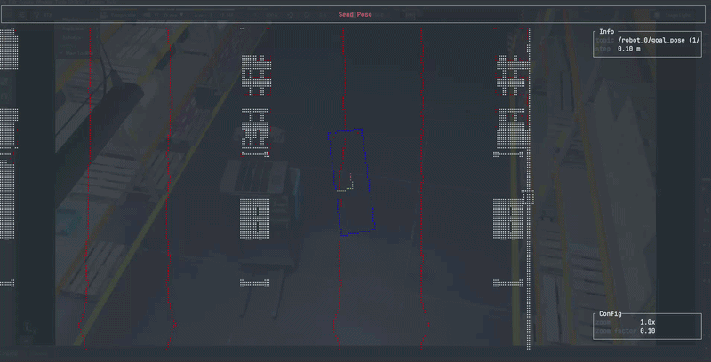
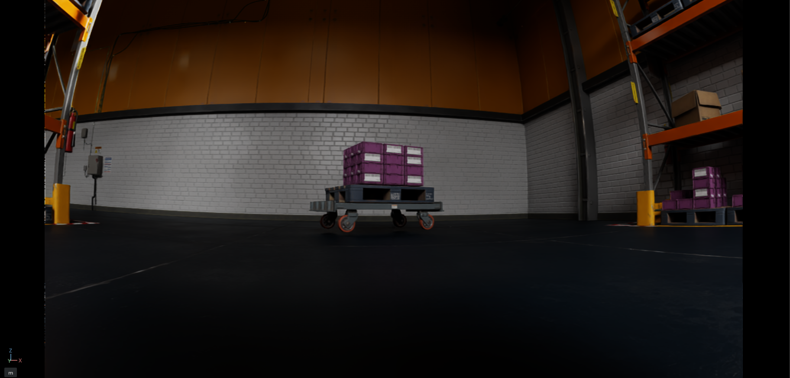
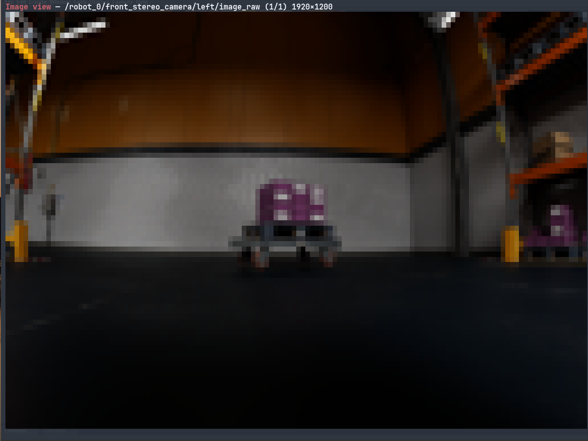
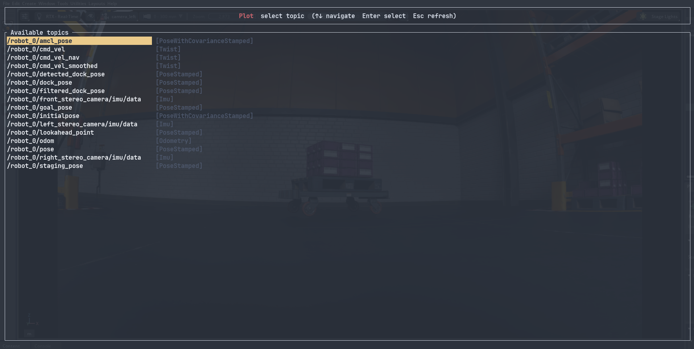
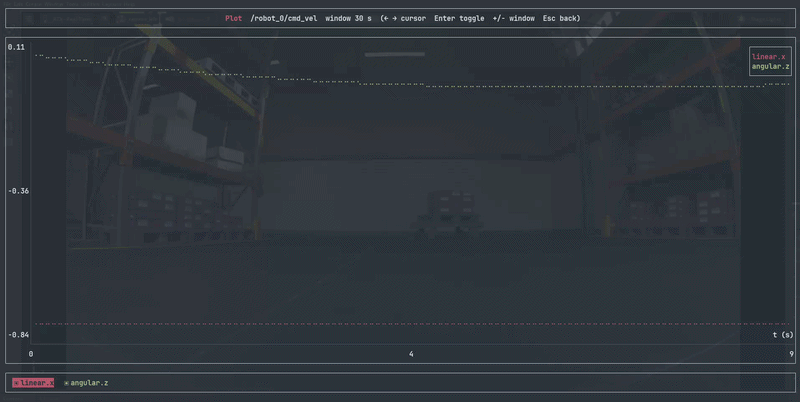

# TermViz2 - A terminal-based ROS 2 visualizer

A terminal-based ROS 2 visualizer. Renders maps, laser scans, point clouds, poses, paths, images, and markers directly in the terminal using half-block characters, with support for teleoperation, pose publishing, and real-time data plotting.

**Developed on the shoulders of Carsten Zumsande and others - ROS1 version [termviz](https://github.com/carzum/termviz)!**

**Similar stuff is in the parallel development phase on the TermViz repo - keep an eye on [termviz](https://github.com/carzum/termviz](https://github.com/carzum/termviz/pull/102)!**

 



## Features

- Real-time visualization of common ROS 2 sensor and navigation data
- Terminal-native rendering — no GUI required
- Interactive teleoperation and goal pose publishing
- Image display with rotation support
- Real-time numeric field plotting for sensor topics
- Dynamic topic management with config persistence

## Installation

### Prerequisites

- ROS 2 Jazzy
- [rclrs](https://github.com/ros2-rust/ros2_rust) and Cargo set up for ROS 2 Rust

### Build

```bash
cd /your/ros2_ws
colcon build --packages-select termviz2
source install/setup.bash
```

## Usage

```bash
# Using built-in defaults or auto-discovered config
ros2 run termviz2 termviz2

# Using a custom config file
ros2 run termviz2 termviz2 --config /path/to/termviz2.yml
```

Config is loaded from the first path that exists:
1. `--config <path>` (CLI argument)
2. `~/.config/termviz2/termviz2.yml` (user config)
3. `/etc/termviz2/termviz2.yml` (system config)
4. Built-in defaults

On first launch, the resolved config is written back to `~/.config/termviz2/termviz2.yml`.

## Modes

Switch modes with the number keys `1`–`6`.

| Key | Mode | Description |
|-----|------|-------------|
| `1` | **Viewport** | Main map view with all configured topics |
| `2` | **Teleop** | Publish `Twist` commands to drive the robot |
| `3` | **Send Pose** | Place and publish a goal or initial pose |
| `4` | **Image View** | Display camera images |
| `5` | **Plot** | Real-time time-series plot of numeric fields |
| `6` | **Topic Manager** | Add/remove topics and save the config |

Press `h` to show/hide the context-sensitive help overlay. Press `Ctrl+C` to quit.

### Viewport

Displays the robot and all configured topics on a 2D overhead map:
- Occupancy grids (static maps and costmaps with RViz-style colouring)
- Laser scans, point clouds (z-gradient or RGB coloured)
- Poses, pose arrays, paths, polygons, markers
- Robot frame with configurable axis length

| Key | Action |
|-----|--------|
| `=` / `-` | Zoom in / out |
| `w` `a` `s` `d` | Pan the view |

### Teleop

Publishes `geometry_msgs/msg/Twist` to `cmd_vel_topic`.

| Key | Action |
|-----|--------|
| `w` / `s` | Increase / decrease forward velocity (vx) |
| `a` / `d` | Increase / decrease lateral velocity (vy) |
| `q` / `e` | Rotate left / right (wz) |
| `f` / `r` | Increase / decrease velocity step |

Two modes (set via config):
- **safe** (default) — velocity decays to zero when no key is pressed
- **classic** — velocity holds until explicitly changed

### Send Pose

Places a ghost pose interactively and publishes it on confirmation.

| Key | Action |
|-----|--------|
| `w` `a` `s` `d` | Move the ghost pose |
| `q` / `e` | Rotate the ghost pose |
| `f` / `r` | Increase / decrease step size |
| `n` / `b` | Switch between configured pose topics |
| `Enter` | Publish the pose |
| `Esc` | Reset the ghost pose |

Supports `Pose`, `PoseStamped`, and `PoseWithCovarianceStamped` message types. An optional ghost footprint can be displayed while positioning.

### Image View

Image from Nvidia Isaac SIM:


Same Image in TermViz:


Renders `sensor_msgs/msg/Image` topics as half-block terminal graphics, scaled to fit the terminal.

| Key | Action |
|-----|--------|
| `n` / `b` or `d` / `a` | Next / previous image topic |
| `e` / `q` | Rotate 90° clockwise / counter-clockwise |

### Plot

Browse available ROS 2 topics at runtime and select numeric fields to plot as a scrolling time-series chart.





**Browsing topics:**

| Key | Action |
|-----|--------|
| `w` / `s` | Navigate topics |
| `Enter` | Select topic |
| `Esc` | Refresh topic list |

**Selecting fields:**

| Key | Action |
|-----|--------|
| `w` / `s` | Navigate fields |
| `Enter` | Toggle field selection |
| `=` | Start plotting |
| `Esc` | Go back |

**Plotting:**

| Key | Action |
|-----|--------|
| `a` / `d` | Move field cursor |
| `Enter` | Toggle field visibility |
| `=` / `-` | Widen / narrow time window |
| `Esc` | Go back |

Supported topic types:

| Type | Plottable fields |
|------|-----------------|
| `nav_msgs/msg/Odometry` | twist (linear/angular), pose (position) |
| `geometry_msgs/msg/Twist` | linear.xyz, angular.xyz |
| `geometry_msgs/msg/TwistStamped` | twist.linear.xyz, twist.angular.xyz |
| `geometry_msgs/msg/PoseStamped` | position.xyz, orientation.xyz |
| `geometry_msgs/msg/PoseWithCovarianceStamped` | pose position.xyz, orientation.xyz |
| `sensor_msgs/msg/Imu` | linear_acceleration.xyz, angular_velocity.xyz, orientation.xyzw |
| `sensor_msgs/msg/BatteryState` | voltage, current, percentage, temperature, charge, capacity |
| `sensor_msgs/msg/Range` | range |
| `sensor_msgs/msg/NavSatFix` | latitude, longitude, altitude |
| `sensor_msgs/msg/MagneticField` | magnetic_field.xyz |
| `sensor_msgs/msg/Temperature` | temperature |
| `sensor_msgs/msg/FluidPressure` | fluid_pressure |

### Topic Manager


Dynamically add or remove topics from the active visualization without restarting. Changes are saved to `~/.config/termviz2/termviz2.yml`.

| Key | Action |
|-----|--------|
| `w` / `s` | Navigate list |
| `d` | Add highlighted topic to active |
| `a` | Remove highlighted topic from active |
| `n` / `b` | Switch between panels |
| `Enter` | Save configuration |

## Configuration

The config file is YAML. Below is a fully annotated example:

```yaml
# TF frames
fixed_frame: map
robot_frame: base_link
tf_topic: /tf
tf_static_topic: /tf_static

# Rendering
target_framerate: 30
axis_length: 0.5          # Length of robot frame axes in metres
visible_area: [-5.0, 5.0, -5.0, 5.0]  # [x_min, x_max, y_min, y_max]
zoom_factor: 0.1          # Fraction of visible_area to zoom per keypress

# Key bindings (values are key names as strings)
key_mapping:
  up: w
  down: s
  left: a
  right: d
  zoom_in: "="
  zoom_out: "-"
  next: n
  previous: b
  show_help: h
  confirm: Enter
  cancel: Esc
  increment_step: f
  decrement_step: r
  rotate_left: q
  rotate_right: e

# Occupancy grids
map_topics:
- topic: /map
  color: {r: 255, g: 255, b: 255}
  threshold: 50           # Cells above this value are drawn
  transient_local: true   # true = static map QoS, false = costmap QoS + RViz colouring

# Laser scans
laser_topics:
- topic: /scan
  color: {r: 200, g: 0, b: 0}

# Point clouds
pointcloud2_topics:
- topic: /pointcloud
  use_rgb: false          # true = use RGB field from cloud, false = z-gradient colouring
  default_color: {r: 255, g: 255, b: 255}

# Poses
pose_topics:
- topic: /pose
  color: {r: 255, g: 165, b: 0}
  style: arrow            # arrow | axes | line
  length: 0.2

# Pose arrays
pose_array_topics:
- topic: /pose_array
  color: {r: 0, g: 255, b: 0}
  style: arrow
  length: 0.2

# Paths
path_topics:
- topic: /plan
  color: {r: 255, g: 0, b: 255}
  style: line             # line | arrow
  length: 0.2

# Polygons (e.g. footprints)
polygon_topics:
- topic: /footprint
  color: {r: 0, g: 0, b: 255}

# Markers
marker_topics:
- topic: /visualization_marker

marker_array_topics:
- topic: /visualization_marker_array

# Camera images
image_topics:
- topic: /camera/image_raw
  rotation: 0             # 0 | 90 | 180 | 270

# Odometry (used for velocity display in teleop view)
odom_topics:
- topic: /odom

# Goal / initial pose publishing
send_pose_topics:
- topic: /goal_pose
  msg_type: PoseStamped   # Pose | PoseStamped | PoseWithCovarianceStamped
  footprint_topic: /footprint   # optional: show ghost footprint while positioning
  footprint_color: {r: 255, g: 165, b: 0}

# Teleoperation (omit section to disable teleop mode)
teleop:
  cmd_vel_topic: /cmd_vel
  default_increment: 0.1  # Initial velocity step
  increment_step: 0.1     # How much f/r changes the step
  publish_cmd_vel_when_idle: false
  mode: safe              # safe | classic
  max_vel: 0.5            # Maximum velocity magnitude
```

## Supported topic types (Viewport)

| ROS 2 type | Config key |
|-----------|-----------|
| `nav_msgs/msg/OccupancyGrid` | `map_topics` |
| `sensor_msgs/msg/LaserScan` | `laser_topics` |
| `sensor_msgs/msg/PointCloud2` | `pointcloud2_topics` |
| `geometry_msgs/msg/PoseStamped` | `pose_topics` |
| `geometry_msgs/msg/PoseArray` | `pose_array_topics` |
| `nav_msgs/msg/Path` | `path_topics` |
| `geometry_msgs/msg/PolygonStamped` | `polygon_topics` |
| `visualization_msgs/msg/Marker` | `marker_topics` |
| `visualization_msgs/msg/MarkerArray` | `marker_array_topics` |
| `sensor_msgs/msg/Image` | `image_topics` |
| `nav_msgs/msg/Odometry` | `odom_topics` |
